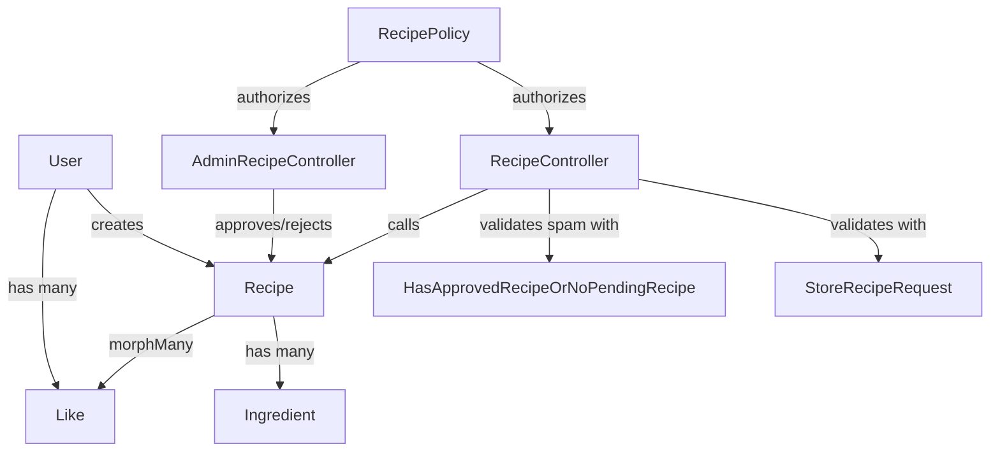
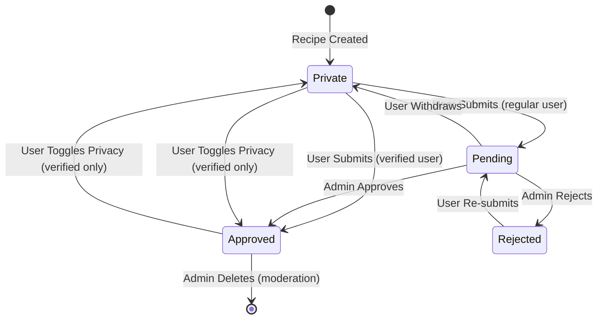
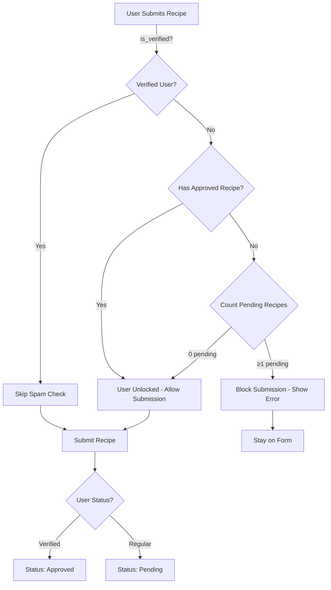

# Project Architecture

Last updated: 2025-10-28

## Overview

**GetCooked** is a Laravel 12 application for recipe sharing with focus on quality control through admin approval workflows and allergen management. The application uses Laravel Breeze for authentication, Tailwind CSS for styling, and Alpine.js for interactive components.

## Folder Structure

```
getcooked/
├── app/
│   ├── Http/
│   │   ├── Controllers/
│   │   │   ├── RecipeController.php          # Recipe CRUD, submission, likes
│   │   │   ├── AdminRecipeController.php     # Admin approval/rejection/moderation
│   │   │   ├── AdminUserController.php       # User verification toggle
│   │   │   └── ProfileController.php         # User profile management
│   │   ├── Middleware/                       # HTTP middleware
│   │   └── Requests/
│   │       ├── StoreRecipeRequest.php        # Recipe creation validation
│   │       └── UpdateRecipeRequest.php       # Recipe update validation
│   ├── Models/
│   │   ├── Recipe.php                        # Recipe model with status transitions
│   │   ├── User.php                          # User model with roles
│   │   ├── Ingredient.php                    # Recipe ingredient model
│   │   └── Like.php                          # Polymorphic like/dislike model
│   ├── Policies/
│   │   ├── RecipePolicy.php                  # Recipe authorization rules
│   │   └── UserPolicy.php                    # User management authorization
│   ├── Providers/                            # Service providers
│   ├── Rules/
│   │   └── HasApprovedRecipeOrNoPendingRecipe.php  # Spam prevention validation
│   └── View/Components/                      # Blade components
├── database/
│   ├── factories/                            # Model factories for testing
│   ├── migrations/                           # Database schema migrations
│   └── seeders/                              # Database seeders
├── resources/
│   ├── css/
│   │   └── app.css                           # Tailwind CSS entry point
│   ├── js/
│   │   └── app.js                            # Alpine.js and Vite entry
│   └── views/
│       ├── layouts/
│       │   ├── app.blade.php                 # Main authenticated layout
│       │   ├── guest.blade.php               # Guest layout (login/register)
│       │   └── navigation.blade.php          # Navigation bar
│       ├── components/                     # Blade components
│       ├── admin/                            # Admin dashboard views
│       ├── recipes/                          # Recipe views
│       └── dashboard.blade.php               # User dashboard
├── routes/
│   └── web.php                               # Application routes
└── tests/
    ├── Feature/                              # Feature/integration tests
    │   ├── RecipeManagementTest.php
    │   ├── AdminRecipeManagementTest.php
    │   ├── SpamPreventionTest.php
    │   └── AdminApprovalNotificationTest.php
    └── Unit/                                 # Unit tests
        └── Rules/
            └── HasApprovedRecipeOrNoPendingRecipeTest.php
```

## Component Relationships



## Recipe Status Workflow



## Spam Prevention System



## Key Files

### Controllers

**RecipeController.php** (`app/Http/Controllers/RecipeController.php`)
- Handles recipe CRUD operations for authenticated users
- `submit()` method validates spam prevention before allowing recipe submission
- Integrates with RecipePolicy for authorization
- Manages likes/dislikes and saved recipes

**AdminRecipeController.php** (`app/Http/Controllers/AdminRecipeController.php`)
- Provides admin dashboard for pending recipe queue
- `approve()` method flashes `recipes_approved_count` to session
- `reject()` method stores rejection reason
- `moderate()` method allows deletion of inappropriate public recipes

### Models

**Recipe.php** (`app/Models/Recipe.php`)
- Defines recipe attributes, relationships, and status scopes
- `submitForApproval()` checks if user is verified and sets appropriate status
- `approve()`, `reject()`, `withdraw()` methods manage status transitions
- Includes `likePercentage` and `dislikePercentage` accessors for YouTube-style ratings

**User.php** (`app/Models/User.php`)
- Standard Laravel User model with added `role` and `is_verified` attributes
- `recipes()` relationship for user's recipes
- `savedRecipes()` many-to-many relationship for favorited recipes

### Validation Rules

**HasApprovedRecipeOrNoPendingRecipe.php** (`app/Rules/HasApprovedRecipeOrNoPendingRecipe.php`)
- Custom validation rule implementing `ValidationRule` and `DataAwareRule`
- Checks if authenticated user has approved recipes (unlocked) or pending count
- Prevents new users from submitting second recipe while first is pending
- Verified users bypass this check entirely (handled in controller)

### Blade Components

*Currently no custom blade components. Future notification system will include notification dropdown component.*

## Database Schema

### Users Table
- `id` (primary key)
- `name`, `email`, `password`
- `role` (enum: 'user', 'admin') - default: 'user'
- `is_verified` (boolean) - default: false
- `email_verified_at`
- timestamps

### Recipes Table
- `id` (primary key)
- `user_id` (foreign key → users)
- `title`, `description`, `photo_path`
- `cook_time`, `difficulty`, `servings`
- `cuisine_type`, `category`
- `dietary_tags` (JSON array)
- `status` (enum: 'private', 'pending', 'approved', 'rejected')
- `rejection_reason` (nullable text)
- `deleted_at` (soft deletes)
- timestamps

### Ingredients Table
- `id` (primary key)
- `recipe_id` (foreign key → recipes)
- `name`, `amount`, `unit`
- `order` (integer for sorting)
- timestamps

### Likes Table (Polymorphic)
- `id` (primary key)
- `user_id` (foreign key → users)
- `likeable_id`, `likeable_type` (polymorphic)
- `is_like` (boolean: true = like, false = dislike)
- timestamps

### User Saved Recipes Table (Pivot)
- `user_id` (foreign key → users)
- `recipe_id` (foreign key → recipes)
- timestamps

## Authentication & Authorization

### Roles
- **User (default)**: Can create/edit own recipes, like/save recipes, submit for approval
- **Admin**: All user permissions + approve/reject pending recipes, delete public recipes, toggle user verification

### Policies

**RecipePolicy** (`app/Policies/RecipePolicy.php`)
- `create()`: All authenticated users
- `update()`, `delete()`: Recipe owner (and not pending status)
- `submitForApproval()`: Recipe owner (and private/rejected status)
- `withdraw()`: Recipe owner (and pending status)
- `approve()`, `reject()`: Admin only

**UserPolicy** (`app/Policies/UserPolicy.php`)
- `toggleVerified()`: Admin only

## Frontend Architecture

### Styling
- **Tailwind CSS v4** for utility-first styling
- Dark mode support via `dark:` classes
- Responsive design with mobile-first approach

### JavaScript
- **Alpine.js** for reactive components (dropdowns, modals, future notification system)
- **Vite** for asset bundling and HMR
- Minimal custom JavaScript - leveraging Alpine.js directives

### Component Patterns
- Section markers in single-file components:
  - `CONFIG SECTION`: Configurable values (colors, durations, endpoints)
  - `CONTROLLER SECTION`: Logic and event handlers
  - `COMPONENT SECTION`: Template markup

## Testing Strategy

### Unit Tests
- Test validation rules in isolation
- Mock Eloquent queries and user authentication
- Focus on edge cases and boundary conditions

### Feature Tests
- Test complete user workflows (create → submit → approve)
- Verify authorization and policy enforcement
- Check session flash and redirection behavior
- Use Laravel's testing helpers (`actingAs`, `assertSessionHas`, etc.)

### Test Database
- SQLite in-memory database for fast test execution
- `RefreshDatabase` trait to reset state between tests
- Factories for generating realistic test data

## Configuration

### Environment Variables
- `DB_CONNECTION=sqlite` - Database connection
- `APP_ENV=local` - Application environment
- `QUEUE_CONNECTION=sync` - Queue driver (can use database/redis in production)

### Key Configuration Files
- `config/app.php` - Application settings
- `config/database.php` - Database connections
- `config/auth.php` - Authentication guards and providers

## Development Workflow

### Running the Application
```bash
composer dev          # Runs Laravel queue worker + Vite dev server concurrently
php artisan serve     # Start Laravel development server
npm run dev           # Start Vite development server (separate terminal)
```

### Running Tests
```bash
php artisan test                    # Run all tests
./vendor/bin/pest                   # Run tests with Pest (alternative)
./vendor/bin/pest --coverage        # Run with coverage report
```

### Code Style
```bash
./vendor/bin/pint                   # Fix code style (Laravel Pint)
```

### Database Operations
```bash
php artisan migrate                 # Run migrations
php artisan migrate:fresh --seed    # Fresh database with seeders
php artisan db:seed                 # Run seeders only
```

## Changelog

See `docs/changelog.md` for detailed project changelog (in Dutch).

---

## Recent Architectural Changes

### Spam Prevention Feature (2025-10-28)
- Added custom validation rule `HasApprovedRecipeOrNoPendingRecipe`
- Modified `RecipeController::submit()` to enforce spam prevention
- Established permanent unlocking pattern (users with ≥1 approved recipe)
- Created context file for future notification system implementation

### Key Architectural Decisions
1. **Validation in Controller vs. FormRequest**: Chose controller-level validation for spam prevention because it applies during submission (status transition) rather than creation
2. **Status-Based Access Control**: Avoided adding `is_unlocked` column; derived unlock status from existing approved recipes count
3. **Notification System Deferred**: Initial toast notification approach proved insufficient (session-based can't notify users across sessions). Created comprehensive context file for future database-backed notification system implementation.

## Future Enhancements

### Planned Features
- **Database-Backed Notification System**: Bell icon with dropdown showing recipe approval/rejection notifications (see `.claude/features/notification-system/01-context.md`)
- **Batch Recipe Approval**: Admin can select multiple recipes and approve in one action
- **Allergen Filtering**: Structured ingredient system with autocomplete to enable reliable allergen-based recipe filtering
- **User Reputation System**: Track approval rate, recipe quality scores
- **Email Notifications**: Notify users when recipes are approved/rejected

### Technical Debt
- Implement notification system to replace session-based feedback
- Add queue processing for batch approval actions (currently synchronous)
- Implement caching layer for popular recipe queries (withCount likes)
