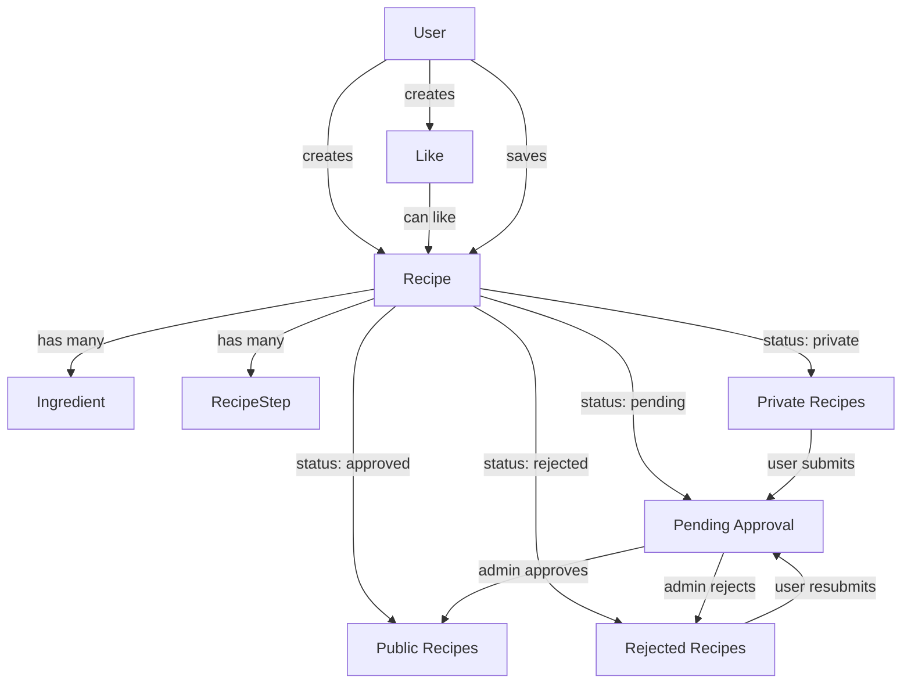
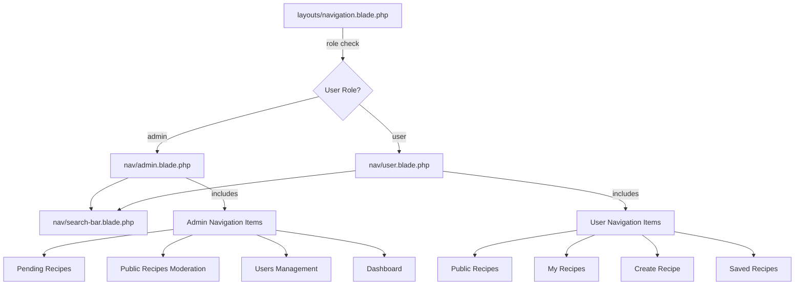
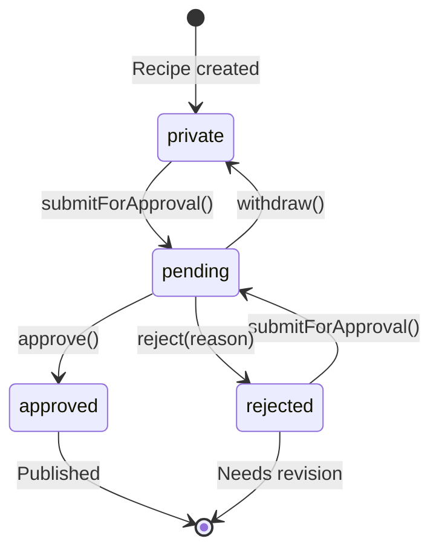

# Project Architecture - GetCooked

Last updated: 2025-11-01

## Overview

GetCooked is a Laravel-based recipe management application with role-based access control, recipe approval workflows, and social features.

## Tech Stack

- **Backend**: Laravel 12 (PHP 8.2+)
- **Frontend**: Vite + Alpine.js + Tailwind CSS v4
- **Auth**: Laravel Breeze
- **Testing**: Pest (PHP testing framework)
- **Code Style**: Laravel Pint
- **Database**: SQLite (development)

## Folder Structure

```
getcooked/
├── app/
│   ├── Http/
│   │   └── Controllers/       # HTTP controllers
│   └── Models/
│       ├── User.php           # User model with roles and relationships
│       ├── Recipe.php         # Recipe model with status workflow
│       ├── Ingredient.php     # Ingredient model
│       ├── RecipeStep.php     # Recipe preparation steps model
│       └── Like.php           # Polymorphic like model
├── database/
│   ├── factories/
│   │   ├── RecipeFactory.php
│   │   ├── IngredientFactory.php
│   │   └── LikeFactory.php
│   └── migrations/
│       ├── [timestamp]_create_recipes_table.php
│       ├── [timestamp]_create_ingredients_table.php
│       ├── [timestamp]_create_likes_table.php
│       └── [timestamp]_create_user_saved_recipes_table.php
├── resources/
│   └── views/
│       ├── components/
│       │   ├── nav/           # Navigation components
│       │   │   ├── user.blade.php
│       │   │   ├── admin.blade.php
│       │   │   └── search-bar.blade.php
│       │   └── *.blade.php    # Other Blade components
│       ├── layouts/
│       │   ├── app.blade.php  # Main application layout
│       │   └── navigation.blade.php  # Role-based navigation wrapper
│       └── dashboard.blade.php  # Public recipes browse view
├── routes/
│   └── web.php                # Web routes
└── tests/
    ├── Feature/               # Feature tests
    └── Unit/
        └── Models/            # Model unit tests
```

## Database Schema

### Entity Relationship Diagram

```mermaid
erDiagram
    User ||--o{ Recipe : owns
    User ||--o{ Like : creates
    User }o--o{ Recipe : saves
    Recipe ||--o{ Ingredient : contains
    Recipe ||--o{ RecipeStep : contains
    Recipe ||--o{ Like : receives

    User {
        id bigint PK
        name string
        email string
        password string
        role enum
        timestamps
    }

    Recipe {
        id bigint PK
        user_id bigint FK
        title string
        description text
        photo_path string
        cook_time int
        difficulty enum
        servings int
        cuisine_type string
        category string
        dietary_tags json
        status enum
        rejection_reason text
        timestamps
        deleted_at timestamp
    }

    Ingredient {
        id bigint PK
        recipe_id bigint FK
        name string
        amount decimal
        unit string
        order int
        timestamps
    }

    RecipeStep {
        id bigint PK
        recipe_id bigint FK
        step_number int
        description text
        timestamps
    }

    Like {
        id bigint PK
        user_id bigint FK
        likeable_id bigint
        likeable_type string
        is_like boolean
        timestamps
    }

    user_saved_recipes {
        user_id bigint FK
        recipe_id bigint FK
        timestamps
    }
```

### Key Relationships

**User Model:**
- `hasMany(Recipe)` - User owns multiple recipes
- `hasMany(Like)` - User can like/dislike multiple items
- `belongsToMany(Recipe, 'user_saved_recipes')` - User can save favorite recipes

**Recipe Model:**
- `belongsTo(User)` - Recipe belongs to one user (author)
- `hasMany(Ingredient)` - Recipe has multiple ingredients (ordered)
- `hasMany(RecipeStep)` - Recipe has multiple preparation steps (ordered by step_number)
- `morphMany(Like)` - Recipe can receive likes/dislikes
- `belongsToMany(User, 'user_saved_recipes')` - Recipe can be saved by multiple users

**Ingredient Model:**
- `belongsTo(Recipe)` - Ingredient belongs to one recipe
- Cascade delete: ingredients are deleted when recipe is deleted

**RecipeStep Model:**
- `belongsTo(Recipe)` - Step belongs to one recipe
- Touch behavior: updates recipe.updated_at when step is modified
- Cascade delete: steps are deleted when recipe is force deleted

**Like Model:**
- `belongsTo(User)` - Like belongs to one user
- `morphTo(likeable)` - Like can be attached to any model (currently Recipe)

## Component Relationships



## View Layer & Navigation

### Navigation System



**Role-Based Navigation:**
- `layouts/navigation.blade.php` checks user role via `Auth::user()?->role === 'admin'`
- Conditionally renders `<x-nav.admin />` or `<x-nav.user />`
- Both components maintain identical styling and structure
- Alpine.js handles mobile menu toggling
- Responsive design: horizontal navigation (desktop), hamburger menu (mobile)

**Navigation Components:**
- `nav/user.blade.php` - Regular user navigation with recipe management links
- `nav/admin.blade.php` - Admin navigation with moderation and management links
- `nav/search-bar.blade.php` - Placeholder search component (disabled, awaiting implementation)

### Dashboard Browse View

The dashboard serves as the main landing page for authenticated users, displaying a paginated grid of public recipes.

**Route:** `/dashboard`
**Query:**
```php
Recipe::public()
    ->with(['user', 'likes'])
    ->withCount([
        'likes as likes_like_count' => fn($query) => $query->where('is_like', true),
        'likes as likes_dislike_count' => fn($query) => $query->where('is_like', false),
    ])
    ->orderBy('created_at', 'desc')
    ->paginate(15);
```

**Features:**
- Displays only approved recipes (`status = 'approved'`)
- Responsive grid layout (1 column mobile, 2 tablet, 3 desktop)
- Recipe cards with photo/placeholder, metadata, like/dislike ratios
- Pagination (15 recipes per page)
- Empty state with call-to-action when no public recipes exist
- Eager loading prevents N+1 queries

**Performance Optimization:**
- Eager loads `user` and `likes` relationships
- Pre-calculates like/dislike counts at database level via `withCount`
- Recipe model accessors use pre-calculated aggregates when available
- Single query for pagination count

## Business Logic

### Recipe Status Workflow



**Status Transition Rules:**
- `private` → `pending`: User submits recipe for approval
- `rejected` → `pending`: User resubmits after making changes (rejection_reason cleared)
- `pending` → `approved`: Admin approves recipe
- `pending` → `rejected`: Admin rejects with reason
- `pending` → `private`: User withdraws submission

**Guard Clauses:**
- Cannot submit for approval from `pending` or `approved` status
- Cannot approve/reject unless status is `pending`
- Cannot withdraw unless status is `pending`

### Like/Dislike System

- YouTube-style like/dislike ratio
- Polymorphic design allows any model to be likeable
- Unique constraint: user can only like/dislike once per item
- Accessors calculate percentages:
  - `like_percentage`: rounds to 1 decimal (e.g., 66.7%)
  - `dislike_percentage`: rounds to 1 decimal (e.g., 33.3%)
- Handles edge case: returns 0% when no likes exist

### Spam Prevention System

**Server-Side Validation:**
- Custom validation rule: `HasApprovedRecipeOrNoPendingRecipe`
- Non-verified users limited to 1 pending recipe
- Users unlocked after first recipe approval
- Rejected recipes don't count toward limit
- Verified users bypass all spam prevention

**Client-Side Prevention (Pending Recipe Limit Notification):**
- Alpine.js intercepts form submission on recipe show page
- Hard block: prevents HTTP request when spam limit reached
- Modal displays pending recipe name with link to view it
- Query optimization: only fetches pending recipe data for non-verified users
- Backwards compatible: falls back to server validation if JavaScript disabled

**Implementation:**
```php
// RecipeController@show - queries pending recipe for non-verified users
$pendingRecipe = null;
if (auth()->check() && !auth()->user()->is_verified) {
    $pendingRecipe = auth()->user()->recipes()
        ->where('status', 'pending')
        ->first(['id', 'title']);
}
```

**Modal Flow:**
1. User with pending recipe clicks "Submit for Approval" on different recipe
2. Alpine.js checks if `pendingRecipe` data exists
3. If exists: dispatches modal event, prevents form submission
4. If null: allows normal form submission
5. Modal shows pending recipe name and "View Pending Recipe" link

## Key Files

### Models

**app/Models/Recipe.php**
- Core recipe entity with comprehensive status workflow
- Scopes: `private()`, `pending()`, `approved()`, `rejected()`, `public()`
- Methods: `submitForApproval()`, `approve()`, `reject()`, `withdraw()`
- Accessors: `like_percentage`, `dislike_percentage`
- Soft deletes enabled

**app/Models/Ingredient.php**
- Simple ingredient model with recipe relationship
- Ordered by `order` field for user-defined sequence
- Cascade delete with recipe

**app/Models/RecipeStep.php**
- Preparation step model with recipe relationship
- Ordered by `step_number` field (1-based numbering)
- Touch behavior: updates parent recipe timestamp
- Cascade delete on recipe force delete
- Validation: min 1 step, max 25 steps per recipe

**app/Models/Like.php**
- Polymorphic like/dislike functionality
- Boolean `is_like` (true = like, false = dislike)
- Extensible to any model type

**app/Models/User.php**
- Extended with recipe relationships
- Role-based access (admin/user)
- Manages owned recipes and saved favorites

### Migrations

**Database Schema Features:**
- Enums for status and difficulty (database-level validation)
- Composite indexes for efficient querying (status + user_id)
- Foreign key constraints with cascade deletes
- Soft deletes on recipes for data retention
- Polymorphic columns for extensible like system
- Pivot table for many-to-many saved recipes

### Factories

- Realistic test data generation
- State methods for different recipe statuses
- Domain-appropriate data (cuisine types, dietary tags, cooking units)

## Design Decisions

### Why SQLite?
- Simple setup for development and academic projects
- Portable database file
- Sufficient for application scope
- Easy testing with in-memory database

### Why Polymorphic Likes?
- Future extensibility (comments, reviews, user profiles can be liked)
- Single table for all like/dislike data
- Consistent API across different entities

### Why Soft Deletes on Recipes?
- Data retention for analytics
- Potential recovery of accidentally deleted recipes
- Preserves user history
- No impact on public-facing queries (automatically filtered)

### Why Status Enum in Database?
- Database-level validation prevents invalid states
- Type safety at schema level
- Better than string comparison
- Self-documenting schema

### Why Composite Index (status, user_id)?
- Efficient queries: "find my pending recipes"
- Common access pattern in user dashboard
- Minimal storage overhead
- Significant query performance improvement

## Testing Strategy

### Unit Tests (19 tests)
- Model relationships verified
- Status transition guards tested
- Edge cases covered (division by zero, cascade deletes)
- Scopes and accessors validated
- RecipeStep relationships and ordering tested

### Feature Tests (39 tests)
- Navigation rendering for different user roles
- Dashboard browse functionality
- Recipe card display and pagination
- Empty state handling
- Role-based access control
- Recipe steps creation and validation
- Recipe steps display and management
- Spam prevention validation
- Pending recipe limit notification

### Test Files
**Unit Tests:**
- `tests/Unit/Models/RecipeTest.php` - Recipe model tests
- `tests/Unit/Models/IngredientTest.php` - Ingredient model tests
- `tests/Unit/Models/LikeTest.php` - Like model tests
- `tests/Unit/Models/RecipeStepTest.php` - RecipeStep model tests (5 tests)
- `tests/Unit/Models/UserRecipeRelationshipsTest.php` - User relationships

**Feature Tests:**
- `tests/Feature/NavigationTest.php` - Navigation rendering tests (8 tests)
- `tests/Feature/DashboardBrowseTest.php` - Dashboard functionality tests (11 tests)
- `tests/Feature/RecipeManagementTest.php` - Recipe CRUD tests
- `tests/Feature/RecipePolicyTest.php` - Authorization tests
- `tests/Feature/AdminRecipeManagementTest.php` - Admin workflow tests
- `tests/Feature/RecipeStepsManagementTest.php` - Recipe steps functionality (8 tests)
- `tests/Feature/SpamPreventionTest.php` - Spam prevention validation (6 tests)
- `tests/Feature/PendingRecipeLimitNotificationTest.php` - Client-side spam prevention notification (6 tests)

## Next Steps

Planned features (from recipe-management context):
1. **Authorization (02-authorization)** - Policy-based access control
2. **User Recipes (03-user-recipes)** - CRUD operations for recipe management
3. **Admin System (04-admin-system)** - Approval workflow UI and admin dashboard

## Development Workflow

```bash
# Run migrations
php artisan migrate

# Run tests
./vendor/bin/pest

# Seed database
php artisan db:seed

# Run development server
composer dev
```

## Configuration

- Database: `.env` (DB_CONNECTION=sqlite)
- App settings: `config/app.php`
- Routes: `routes/web.php`
