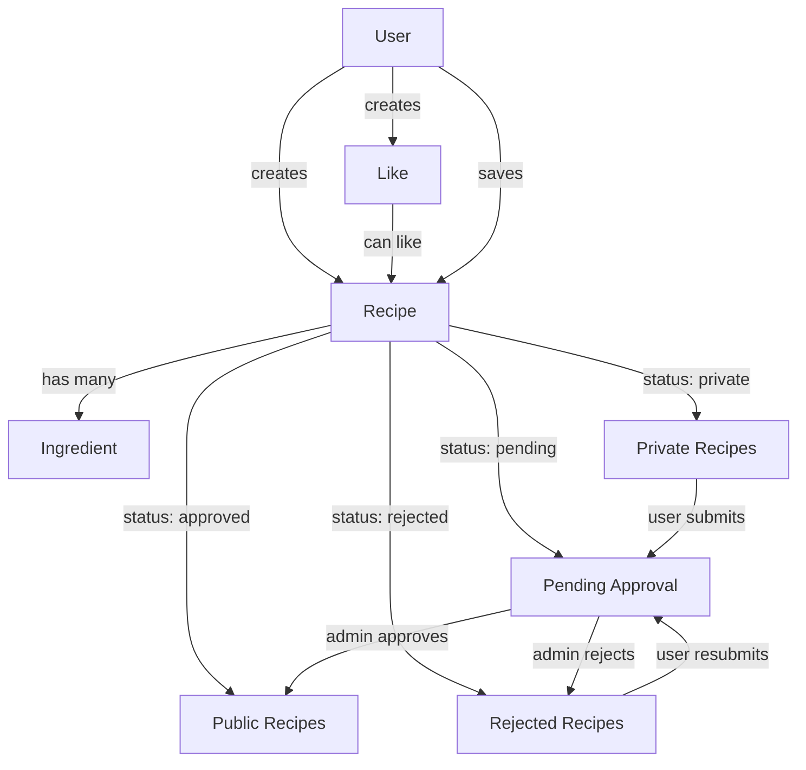
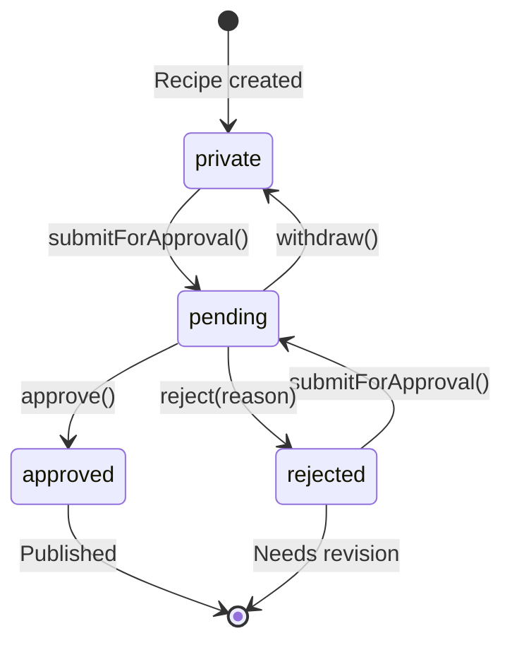

# Project Architecture - GetCooked

Last updated: 2025-10-25

## Overview

GetCooked is a Laravel-based recipe management application with role-based access control, recipe approval workflows, and social features.

## Tech Stack

- **Backend**: Laravel 12 (PHP 8.2+)
- **Frontend**: Vite + Alpine.js + Tailwind CSS v4
- **Auth**: Laravel Breeze
- **Testing**: Pest (PHP testing framework)
- **Code Style**: Laravel Pint
- **Database**: SQLite (development)

## Folder Structure

```
getcooked/
├── app/
│   ├── Http/
│   │   └── Controllers/       # HTTP controllers
│   └── Models/
│       ├── User.php           # User model with roles and relationships
│       ├── Recipe.php         # Recipe model with status workflow
│       ├── Ingredient.php     # Ingredient model
│       └── Like.php           # Polymorphic like model
├── database/
│   ├── factories/
│   │   ├── RecipeFactory.php
│   │   ├── IngredientFactory.php
│   │   └── LikeFactory.php
│   └── migrations/
│       ├── [timestamp]_create_recipes_table.php
│       ├── [timestamp]_create_ingredients_table.php
│       ├── [timestamp]_create_likes_table.php
│       └── [timestamp]_create_user_saved_recipes_table.php
├── resources/
│   └── views/                 # Blade templates
├── routes/
│   └── web.php                # Web routes
└── tests/
    ├── Feature/               # Feature tests
    └── Unit/
        └── Models/            # Model unit tests
```

## Database Schema

### Entity Relationship Diagram

```mermaid
erDiagram
    User ||--o{ Recipe : owns
    User ||--o{ Like : creates
    User }o--o{ Recipe : saves
    Recipe ||--o{ Ingredient : contains
    Recipe ||--o{ Like : receives

    User {
        id bigint PK
        name string
        email string
        password string
        role enum
        timestamps
    }

    Recipe {
        id bigint PK
        user_id bigint FK
        title string
        description text
        photo_path string
        cook_time int
        difficulty enum
        servings int
        cuisine_type string
        category string
        dietary_tags json
        status enum
        rejection_reason text
        timestamps
        deleted_at timestamp
    }

    Ingredient {
        id bigint PK
        recipe_id bigint FK
        name string
        amount decimal
        unit string
        order int
        timestamps
    }

    Like {
        id bigint PK
        user_id bigint FK
        likeable_id bigint
        likeable_type string
        is_like boolean
        timestamps
    }

    user_saved_recipes {
        user_id bigint FK
        recipe_id bigint FK
        timestamps
    }
```

### Key Relationships

**User Model:**
- `hasMany(Recipe)` - User owns multiple recipes
- `hasMany(Like)` - User can like/dislike multiple items
- `belongsToMany(Recipe, 'user_saved_recipes')` - User can save favorite recipes

**Recipe Model:**
- `belongsTo(User)` - Recipe belongs to one user (author)
- `hasMany(Ingredient)` - Recipe has multiple ingredients (ordered)
- `morphMany(Like)` - Recipe can receive likes/dislikes
- `belongsToMany(User, 'user_saved_recipes')` - Recipe can be saved by multiple users

**Ingredient Model:**
- `belongsTo(Recipe)` - Ingredient belongs to one recipe
- Cascade delete: ingredients are deleted when recipe is deleted

**Like Model:**
- `belongsTo(User)` - Like belongs to one user
- `morphTo(likeable)` - Like can be attached to any model (currently Recipe)

## Component Relationships



## Business Logic

### Recipe Status Workflow



**Status Transition Rules:**
- `private` → `pending`: User submits recipe for approval
- `rejected` → `pending`: User resubmits after making changes (rejection_reason cleared)
- `pending` → `approved`: Admin approves recipe
- `pending` → `rejected`: Admin rejects with reason
- `pending` → `private`: User withdraws submission

**Guard Clauses:**
- Cannot submit for approval from `pending` or `approved` status
- Cannot approve/reject unless status is `pending`
- Cannot withdraw unless status is `pending`

### Like/Dislike System

- YouTube-style like/dislike ratio
- Polymorphic design allows any model to be likeable
- Unique constraint: user can only like/dislike once per item
- Accessors calculate percentages:
  - `like_percentage`: rounds to 1 decimal (e.g., 66.7%)
  - `dislike_percentage`: rounds to 1 decimal (e.g., 33.3%)
- Handles edge case: returns 0% when no likes exist

## Key Files

### Models

**app/Models/Recipe.php**
- Core recipe entity with comprehensive status workflow
- Scopes: `private()`, `pending()`, `approved()`, `rejected()`, `public()`
- Methods: `submitForApproval()`, `approve()`, `reject()`, `withdraw()`
- Accessors: `like_percentage`, `dislike_percentage`
- Soft deletes enabled

**app/Models/Ingredient.php**
- Simple ingredient model with recipe relationship
- Ordered by `order` field for user-defined sequence
- Cascade delete with recipe

**app/Models/Like.php**
- Polymorphic like/dislike functionality
- Boolean `is_like` (true = like, false = dislike)
- Extensible to any model type

**app/Models/User.php**
- Extended with recipe relationships
- Role-based access (admin/user)
- Manages owned recipes and saved favorites

### Migrations

**Database Schema Features:**
- Enums for status and difficulty (database-level validation)
- Composite indexes for efficient querying (status + user_id)
- Foreign key constraints with cascade deletes
- Soft deletes on recipes for data retention
- Polymorphic columns for extensible like system
- Pivot table for many-to-many saved recipes

### Factories

- Realistic test data generation
- State methods for different recipe statuses
- Domain-appropriate data (cuisine types, dietary tags, cooking units)

## Design Decisions

### Why SQLite?
- Simple setup for development and academic projects
- Portable database file
- Sufficient for application scope
- Easy testing with in-memory database

### Why Polymorphic Likes?
- Future extensibility (comments, reviews, user profiles can be liked)
- Single table for all like/dislike data
- Consistent API across different entities

### Why Soft Deletes on Recipes?
- Data retention for analytics
- Potential recovery of accidentally deleted recipes
- Preserves user history
- No impact on public-facing queries (automatically filtered)

### Why Status Enum in Database?
- Database-level validation prevents invalid states
- Type safety at schema level
- Better than string comparison
- Self-documenting schema

### Why Composite Index (status, user_id)?
- Efficient queries: "find my pending recipes"
- Common access pattern in user dashboard
- Minimal storage overhead
- Significant query performance improvement

## Testing Strategy

### Unit Tests (14 tests)
- Model relationships verified
- Status transition guards tested
- Edge cases covered (division by zero, cascade deletes)
- Scopes and accessors validated

### Test Files
- `tests/Unit/Models/RecipeTest.php` - Recipe model tests
- `tests/Unit/Models/IngredientTest.php` - Ingredient model tests
- `tests/Unit/Models/LikeTest.php` - Like model tests
- `tests/Unit/Models/UserRecipeRelationshipsTest.php` - User relationships

## Next Steps

Planned features (from recipe-management context):
1. **Authorization (02-authorization)** - Policy-based access control
2. **User Recipes (03-user-recipes)** - CRUD operations for recipe management
3. **Admin System (04-admin-system)** - Approval workflow UI and admin dashboard

## Development Workflow

```bash
# Run migrations
php artisan migrate

# Run tests
./vendor/bin/pest

# Seed database
php artisan db:seed

# Run development server
composer dev
```

## Configuration

- Database: `.env` (DB_CONNECTION=sqlite)
- App settings: `config/app.php`
- Routes: `routes/web.php`
